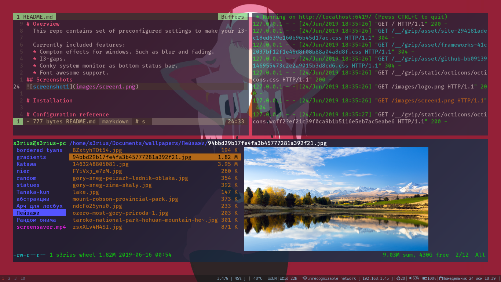
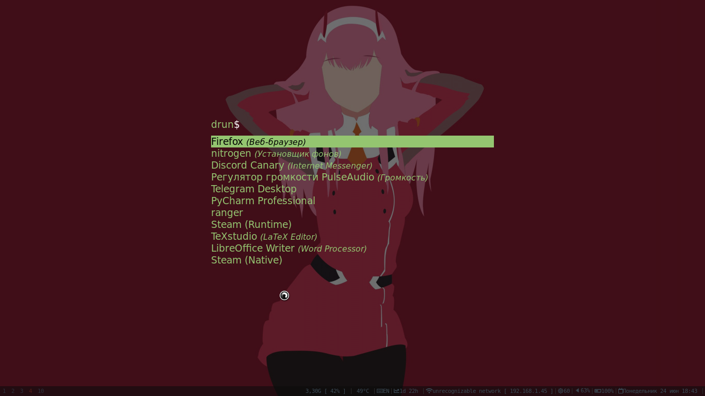
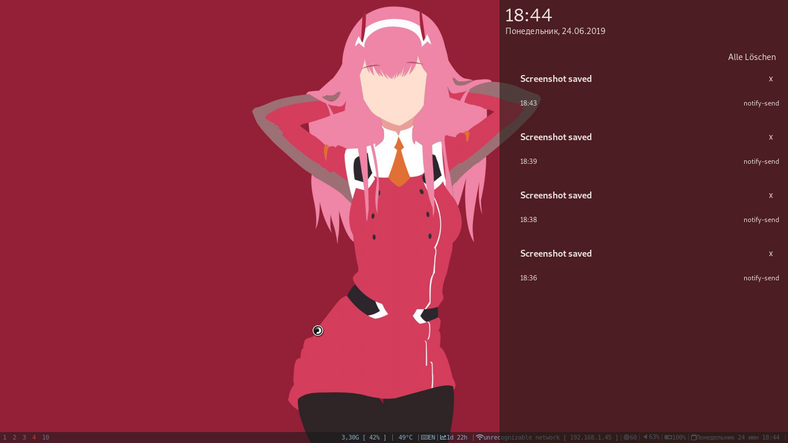

<h1 align="center">
  
</h1>

<h3 align="center">Make your ArchLinux hyper fast and flexible with one script</h3>


<p align="center">
  <a href="#overview">Overview</a> •
  <a href="#installation">Installation</a> •
  <a href="#configuration-reference">Configuration reference</a> •
</p>

# Overview
  This repo contains set of preconfigured settings to make your i3-wm looks beautiful.
  
  Currently included features:  
  * Compton effects for windows. Such as blur and fading.
  * I3-gaps.
  * Conky system monitor as bottom status bar.
  * Font awesome support.
## Screenshots




# Installation
To install this i3setup. You can simply run following:
```bash
git clone https://github.com/s3rius/i3wm-autoConfig.git
cd i3wm-autoConfig/
chmod 777 install.sh
./install.sh
```
This bunch of commands will install this desktop environment on your arch-based distro.

# Key bindings

* Open treminal: `Super+Enter`;
* Go to specific workspace: `Super+N`, where N - number [1-0];
* Send focused window on specific workspace: `Super+Shift+N`;
* Open menu: `Super+d`;
* Take a screenshot to clipboard: `PrtSc`;
* Save screenshot in `~/Pictures/`: `Super+PrtSc`;
* Cut screenshot in clipboard: `Shift+PrtSc`;
* Open home folder: `Super+e`;
* Change keybord layout: `CapsLock`;
* Exit current X session: `Super+Shift+e`;
* Restart i3: `Super+Shift+r`;
* Reload configuration: `Super+Shift+c`;

### Resize mode
* Enter resize mode: `Super+r`;
* Exit resize mode: `Esc` or `Enter`;

Use arrow keys to change focused window size.

### Navigation
* To navigate opened windows on screen use: `Super+Arrow keys`;
* To move windows in current workspace ues: `Super+Shift+Arrow keys`.
### Layouts
* Change layout to stacked: `Super+s`;
* Change layout to tabbed: `Super+w`;
* Change layout to default: `Super+x`;
